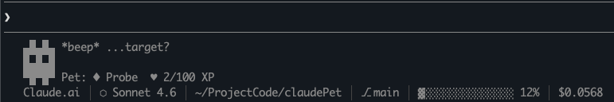
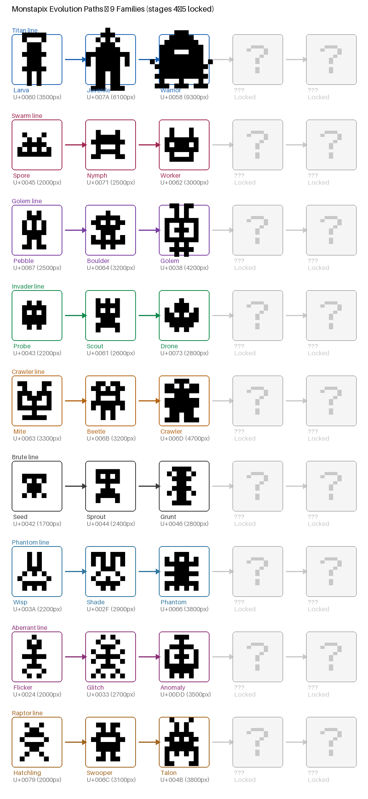

# Claude Pet

[](https://snyk.io/test/github/cs17/claudePet)
[](https://sonarcloud.io/summary/new_code?id=cs17_claudePet)

> Claude removed the `/buddy` feature — *"April Fools feature and has been removed in the latest release, so closing this as not planned."* So I built my own. An evolving pixel-art pet companion for Claude Code that lives in your status line, scores your prompts, and grows stronger as you write better code.

```
▄█▄█▄
█▄█▄█     Pet: Probe  ♥ 42/100 XP
▀█▀█▀
```



## Quick Start

```bash
git clone https://github.com/cs17/claudePet.git
cd claudePet
./install.sh
```

Then restart Claude Code. Your pet appears in the status line.

## What You Get

- **Pixel creature** in your status line that evolves through 5 stages
- **Prompt scoring** across 5 dimensions (specificity, context, actionability, scope, constraints)
- **XP system** — better prompts = more XP = faster evolution
- **9 creature families** — randomly assigned, each with unique personality and voice
- **Streak tracking** — consecutive daily usage earns bonus XP
- **Milestones** — achievements like "Perfect Prompt" award bonus XP
- **`/pet` command** — toggle display on/off, check status, reset with random family

## Evolution Map

9 families, 5 stages each. You're randomly assigned a family on install. XP thresholds: **0 → 100 → 400 → 1,600 → 6,400**



| Family | Stages | Voice |
|--------|--------|-------|
| **Titan** | Larva → Juvenile → Warrior → Elder → Titan | Deep rumble → earth-shaking |
| **Swarm** | Spore → Nymph → Worker → Sentinel → Hive | Faint buzz → omnipresent drone |
| **Golem** | Pebble → Boulder → Golem → Colossus → Monolith | Grinding stone → mountain |
| **Invader** | Probe → Scout → Drone → Soldier → Commander | Static → fleet commander |
| **Crawler** | Mite → Beetle → Crawler → Stalker → Behemoth | Tiny clicks → silence then strike |
| **Brute** | Seed → Sprout → Grunt → Hunter → Brute | Tiny grunt → thunderous roar |
| **Phantom** | Wisp → Shade → Phantom → Wraith → Spectre | Faint whisper → the void speaks |
| **Aberrant** | Flicker → Glitch → Anomaly → Aberrant → Nexus | Corrupted static → omnidimensional |
| **Raptor** | Hatchling → Swooper → Talon → Raptor → Apex | Tiny chirps → thunder from above |

## Scoring Dimensions

Each prompt is scored 0-20 per dimension (max 100 total):

- **Specificity** — file paths, function names, line numbers
- **Context** — background info, expected vs actual behavior
- **Actionability** — clear verbs, imperative instructions
- **Scope** — focused vs overly broad requests
- **Constraints** — tech preferences, style rules, limits

## Commands

- `/pet on` — show pet in status line
- `/pet off` — hide pet
- `/pet status` — check XP, level, streak
- `/pet reset` — reset with a random new family

## Requirements

- Node.js 20+
- Claude Code CLI (`claude`)
- `jq` (for status line rendering)
- **Dark terminal theme** — pixel creatures use Unicode block characters that are invisible on light backgrounds

## Uninstall

```bash
claude mcp remove claude-pet
rm -rf ~/.claude/claude-pet ~/.claude/skills/pet
```

Remove the `UserPromptSubmit` hook and `statusLine` entries from `~/.claude/settings.json`.

<details>
<summary>What install.sh does</summary>

1. Checks prerequisites (Node.js, jq)
2. `npm install && npm run build`
3. Registers MCP server via `claude mcp add`
4. Adds prompt-scoring hook to `~/.claude/settings.json`
5. Sets up status line with creature display
6. Copies data files and `/pet` skill to `~/.claude/`
7. Randomly assigns a creature family

</details>

<details>
<summary>MCP Tools (advanced)</summary>

| Tool | Description |
|------|-------------|
| `analyze_prompt` | Score a prompt, award XP, get suggestions |
| `get_pet_status` | See level, XP, personality |
| `log_activity` | Bonus XP for commits, tests, PRs |
| `get_evolution_history` | View evolution timeline |

</details>

<details>
<summary>Data files</summary>

Pet state persists in `~/.claude/claude-pet/`:
- `state.json` — XP, level, streaks, milestones, assigned family
- `sprites.json` — block-art creature sprites
- `creatures.json` — creature registry
- `config.json` — display toggle
- `prompt-history.json` — last 50 scored prompts

</details>

## Credits

Creature pixel art derived from [MonstaPix](http://fontstruct.com/fontstructions/show/475298) by **Ken Bruce**, licensed under [CC BY-NC-SA 3.0](http://creativecommons.org/licenses/by-nc-sa/3.0/).

## License

This project is non-commercial and open source.

- **Code:** [MIT License](LICENSE)
- **Creature sprites:** [CC BY-NC-SA 3.0](http://creativecommons.org/licenses/by-nc-sa/3.0/) — derived from MonstaPix by Ken Bruce
